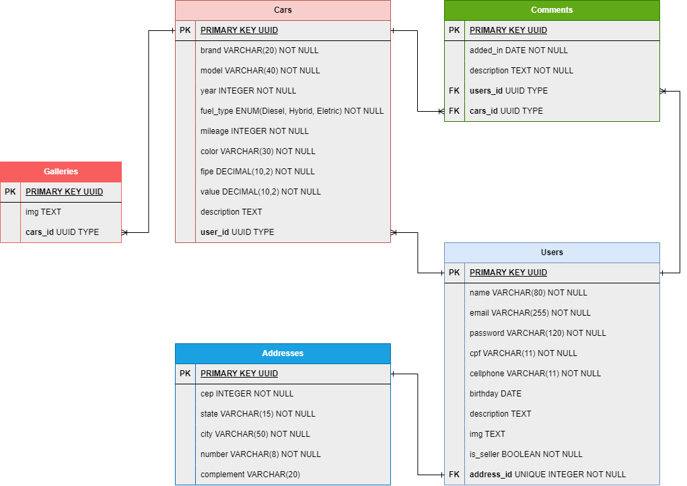

# Projeto Final BackEnd - M6 - Kenzie Academy Brasil

# Sobre o projeto

Essa API foi desenvolvida para o projeto final de conclusão do módulo 6 do curso de Desenvolvimento FullStack da Kenzie Academy Brasil.

# Documentação da API

Para documentação completa acesse: https://group23-t14-felipe.onrender.com/doc/

## Tabela de Conteúdos

- [Visão Geral](#1-visão-geral)
- [Diagrama ER](#2-diagrama-er)
- [Comandos](#3-Comandos)
- [Variáveis de Ambiente](#4-variáveis-de-ambiente)
- [Migrations](#5-migrations)
- [Integrantes](#6-integrantes)

---

## 1. Visão Geral

Visão geral do projeto, um pouco das tecnologias usadas.

- [Express](https://expressjs.com/pt-br/)
- [TypeScript](https://www.typescriptlang.org/)
- [PostgreSQL](https://www.postgresql.org/)
- [TypeORM](https://typeorm.io/)

A URL base da aplicação:
https://group23-t14-felipe.onrender.com/

---

## 2. Diagrama ER

Diagrama ER da API definindo bem as relações entre as tabelas do banco de dados.



### 3 - Comandos

 - Instalando Dependências

Clone o projeto em sua máquina e instale as dependências com o comando:

```shell
npm install
```
or
```shell
yarn 
```

Para rodar o servidor local utilize os seguintes comandos:

```shell
npm run dev
```
or

```shell
yarn dev
```


## 4 - Variáveis de Ambiente

Em seguida, crie um arquivo **.env**, copiando o formato do arquivo **.env.example**:
```
cp .env.example .env
```

Configure suas variáveis de ambiente com suas credenciais do Postgres e uma nova database da sua escolha.

## 5 - Migrations

Execute as migrations com o comando:

```
yarn typeorm migration:run -d src/data-source.ts
```

---

## Repositório do FrontEnd
O repositório do frontend pode ser encontrado no seguinte link:
https://github.com/grupo-23-t14-felipe/cars-shop-frontend

e o deploy do frontend neste link:
https://cars-shop-frontend.vercel.app/

[ Voltar para o topo ](#tabela-de-conteúdos)

##  6 - Integrantes

- Wigny Oliveira
- Hugo Britto
- Mateus Rossi Rocha
- Ana Carla da Silva
- Natalia Pereira


